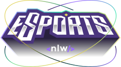
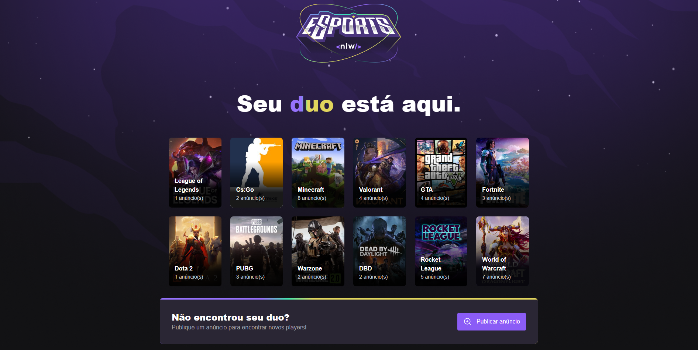
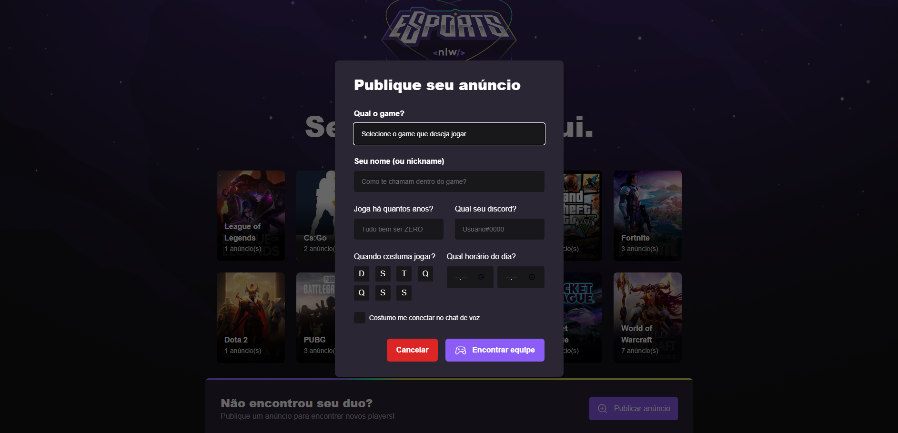

  

## 📚 Sobre

O NLW eSports é um projeto desenvolvido junto com a Rocketseat no evento realizado, na Trilha Ignite, estudamos React com TypeScript.

## 🚀 Projeto

A plataforma tem como foco o público gamer, conectar jogadores, o sistema permite que você selecione o seu jogo e procure jogadores cadastrados que estão disponíveis para se conectar e jogar. Na aplicação WEB, o usuário pode escolher seu jogo favorito, criar e procurar anúncios para assim encontrar outros jogadores.

## 💻 Preview

    
    

## 📎 Tecnologias

- [Typescript](https://www.typescriptlang.org/docs/)
- [React](https://pt-br.reactjs.org/)
- [Tailwind](https://tailwindcss.com/)
- [Axios](https://axios-http.com/)
- [Vite](https://vitejs.dev/)
